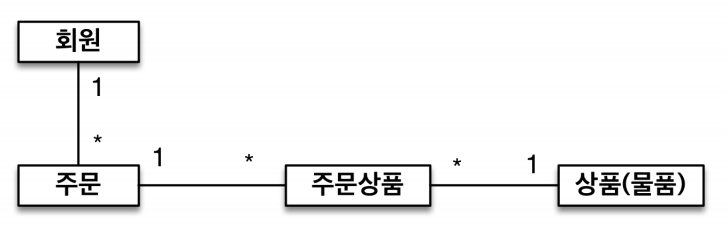
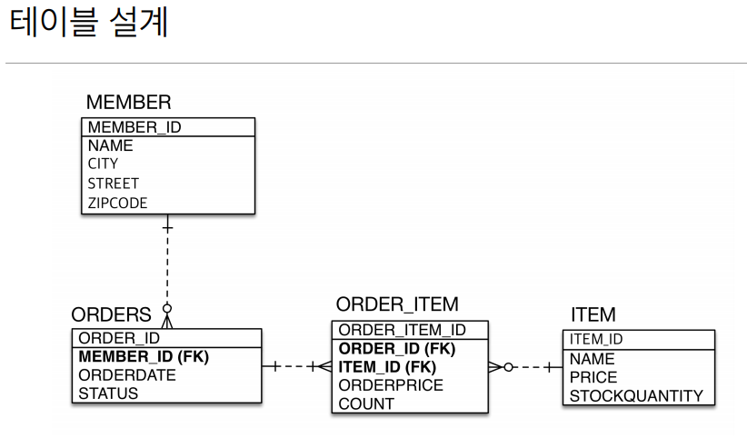
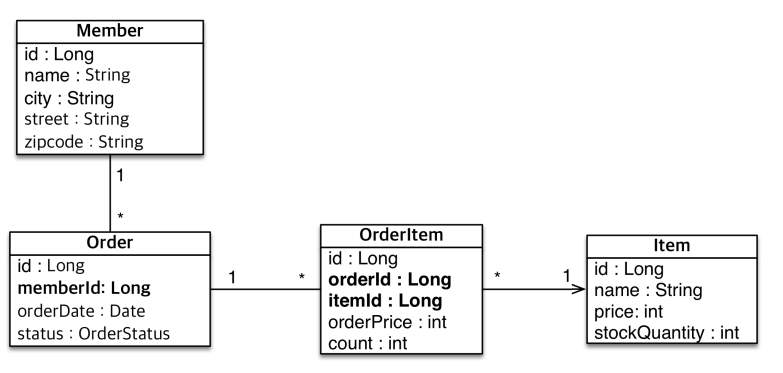

## 자바 ORM 표준 JPA 프로그래밍 

[JPA소개](#JPA-소개)  
[JPA시작하기](#JPA-시작하기)  
[영속성 관리 - 내부 동작 방식](#영속성-관리-_-내부-동작-방식)  
[엔티티 매핑](#엔티티-매핑)  

### JPA 소개

#### JPA 실무에서 어려운 이유
- 처음 JPA나 스프링 데이터 JPA를 만나면?
- SQL 자동화, 수십줄의 코드가 한 두줄로
- 실무에 바로 도입하면?
- 예제들은 보통 테이블이 한 두개로 단순함
- 실무는 수십 개 이상의 복잡한 객체와 테이블 사용

목표 - 객체와 테이블 설계
- 객체와 테이블을 제대로 설계하고 매핑하는 방법
- 기본 키와 외래 키 매핑
- 1:N, N:1, 1:1, N:M 매핑
- 실무 노하우 + 성능까지 고려

목표 - JPA 내부 동작 방식 이해
- JPA의 내부 동작 방식을 이해하지 못하고 사용
- JPA 내부 동작 방식을 그림과 코드로 자세히 설명
- JPA가 어떤 SQL을 만들어 내는지 이해
- JPA가 언제 SQL을 실행하는지 이해


JPA로 시간이 남아 더 많은 Test Code를 만들 수 있고 구조를 개선할 수 있었다.


#### SQL 중심적인 개발의 문제점
지금 시대는 객체를 관계형 DB에 관리
> 무한 반복, 지루한 코드
> CRUD

패러다임의 불일치
객체 vs 관계형 데이터베이스

객체를 영구 보관하는 다양한 저장소 DB

객체와 관계형 데이터베이스의 차이
1. 상속 
db에서 데이터를 조회할때 join해서 가져와야한다. 
2. 연관관계 
객체다운 모델링 - 팀id가 아닌 팀을 넣어야하는 것이 아닌가?
4. 데이터 타입
5. 데이터 식별 방법

##### JPA (Java Persistence API)
ORM (Object-relation mapping)

JPA 동작 - 저장
Entitiy Object를 넘기면 - Entity 분석 JDBC API - INSERT

#### JPA 소개
EJB라는 것이 있었는데 엉망이었음 - JPA (자바 표준)
                           하이버네이트(오픈소스)
                           
#### JPA는 표준 명세
- JPA는 인터페이스의 모음 - jpa는 인터페이스
- 하이버네이트, EclipseLink, DataNucleus 구현체

#### 생산성 - JPA와 CRUD
사상자체가 자바 컬렉션에 값을 넣었다가 뺐다가 하는 것과 같다.
저장 jpa.persist
조회 jpa.find
수정 member.setName
삭제 jpa.remove

jpa 동일한 트랜잭션에서 조회한 엔티티는 같음을 보장

#### JPA의 성능 최적화 기능
1. 1차 캐시와 동일성(identity)보장 - DB Isolation Level이 Read Commit이어도 애플리케이션에서 Repeatable Read 보장
3. 트랜잭션을 지원하는 쓰기 지연 (transactional write-behind) - JDBC BATCH SQL 기능을 가능하게 해줌 transaction.begin()
4. 지연 로딩(Lazy Loading) - 옵션하나로 지연로딩이 가능하다.

ORM은 객체와 RDB 두 기둥위에 있는 기술


### JPA 시작하기

#### JPA 구동 방식

Persistence -> 생성 -> EntitiyManagerFactory -> EntitiyManager 생성

​         |

1. 설정 정보 조회

​         |

META-INF/persistence.xml


#### JPQL

- 테이블이 아닌 객체를 대상으로 검색하는 객체 지향 쿼리
- SQL을 추상화해서 특정 데이터베이스 SQL에 의존 X
- JPQL을 한마디로 정의하면 객체 지향 SQL
- JPQL은 뒤에서 아주 자세히 다룸


### 영속성 관리 _ 내부 동작 방식

JAP에서 가장 중요한 2가지

- 객체와 관계형 데이터베이스 매핑
- 영속성 컨텍스트
  - JPA를 이해하는데 가장 중요한 용어
  - 엔티티를 영구 저장하는 환경이라는 뜻
  - EntityManager.persist(entity);

> 영속성 컨텍스트는 논리적인 개념
>
> 눈에 보이지 않는다.
>
> 엔티티 매니저를 통해서 영속성 컨텍스트에 접근


#### 엔티티의 생명주기

- 비영속 (new/transient)
- 영속 (managed)
- 준영속 (detached)
- 삭제 (removed)

```java
//1. 비영속
Member member = new Member();
member.setId("member1");
member.setName(회원1);

//2. 영속
em.persist(member); //관리가 되는 상태

//3. 준영속
em.detatch(member); //영속성 컨텍스트에서 다시 지움

em.remove(member)

```

#### !!!!!!!!!!!!영속성 컨텍스트의 이점

- 1차 캐시

DB가 아닌 1차 캐시를 찾는다.

- 동일성 보장
- 트랜잭션을 지원하는 쓰기 지연
- 변경 감지

엔티티 수정을하면 em.update(member1)이 있어야 할 것 같지만 저절로 감지

flush를 하면 엔티티와 스냅샷(최초로 불러온 상태)를 비교하고 update쿼리를 db에 반영하고 commit한다.

- 지연 로딩


#### 플러시

영속성 컨텍스트의 변경내용을 데이터베이스에 반영

- 변경 감지
- 수정된 엔티티 쓰기 지연 SQL 저장소에 등록
- 쓰기 지연 SQL 저장소의 쿼리를 데이터베이스에 전송 (등록, 수정, 삭제)

영속성 컨텍스트를 플러시하는 방법

em.flush()
commit할때
JPQL 쿼리 실행

> 플러시 모드 옵션
>
> FlushModeType.AUTO auto (default)
>
> FlushModeType.COMMIT 커밋할때만

!!! 

영속성 컨텍스트를 비우지 않음

영속성 컨텍스트의 변경내용을 데이터베이스에 동기화

트랜잭션이라는 작업 단위가 중요 -> 커밋 직전에만 동기화하면 됨


#### 준영속 상태

- 영속 -> 준영속
- 영속 상태의 엔티티가 영속성 컨텍스트에서 분리 (detatched)
- 영속성 컨텍스트가 제공하는 기능을 사용 못 함

```
em.detatch(entity)
em.clear()
em.close()
```


### 엔티티 매핑

#### 객체와 테이블 매핑

@Entity, @Table

필드와 컬럼 매핑

@Column

기본 키 매핑

@Id

연관관계 매핑:

@ManyToOne, @JoinColumn


##### @Entity

> @Entity가 붙은 클래스는 JPA가 관리, 엔티티라 한다.
>
> JPA를 사용해서 테이블과 매핑할 클래스는 @Entity필수
>
> !주의
>
> - 기본 생성자 필수 publi or protected
> - final클래스, enum, interface, inner 클래스 사용 X
> - 저장할 필드에 final사용 X


#### 데이터베이스 스키마 자동 생성

- DDL을 애플리케이션 실행 시점에 자동 생성
- 테이블 중심 -> 객체 중심
- 데이터베이스 방언을 활용해서 데이터베이스에 맞는 적절한 DDL생성
- 이렇게 생성된 DDL은 개발 장비에서만 사용
- 생성된 DDL은 운영서버에서는 사용하지 않거나 적절히 다듬은 후 사용

> hibernate.hbm2ddl.auto option

> 개발
>
> create : drop + create
> create-drop : 끝난 후 drop (test-case 실행시)
> update: 변경만 적용 지우는 것은 안된다.

> staging
> validate : 엔티티와 테이블이 정상 매핑 확인
> none : 사용하지 않음

##### DDL 생성 가능

DDL 생성 기능은 DDL을 실행할때만 사용되고 JPA의 실행 로직에는 영향 주지 않음

@Column(unique = true, length = 10) alter table이 실행 됨


#### 필드와 컬럼 매핑

> @Column 컬럼 매핑
>
> name 필드와 매핑할 테이블의 컬럼 이름 객체의 필드 이름 
>
> insertable,  updatable 등록, 변경 가능 여부 TRUE 
>
> nullable(DDL) null 값의 허용 여부를 설정한다. false로 설정하면 DDL 생성 시에 not null 제약조건이 붙는다.  unique(DDL) @Table의 uniqueConstraints와 같지만 한 컬럼에 간단히 유니크 제 약조건을 걸 때 사용한다. 
>
> columnDefinition (DDL)  데이터베이스 컬럼 정보를 직접 줄 수 있다.  ex) varchar(100) default ‘EMPTY' 필드의 자바 타입과 방언 정보를 사용해 서 적절한 컬럼 타입 length(DDL) 문자 길이 제약조건, String 타입에만 사용한다. 255 precision,  scale(DDL)  BigDecimal 타입에서 사용한다(BigInteger도 사용할 수 있다). 
>
>  precision은 소수점을 포함한 전체 자 릿수를, scale은 소수의 자릿수 다. 참고로 double, float 타입에는 적용되지 않는다. 아주 큰 숫자나 정 밀한 소수를 다루어야 할 때만 사용한다.  precision=19,  scale=2
>
> @Temporal 날짜 타입 매핑
>
> @Enumberated enum 타입 매핑
>
> @Lob BLOB CLOB 매핑
>
> @Transient 매핑 무시


#### 기본 키 매핑

직접 할당: @Id

자동 생성: @GeneratedValue

- IDENTITY : 데이터베이스에 위임, MYSQL

!! null이 와서 id 값을 db에 넣어봐야 id 값을 확은 가능하다
JPA 입장에서는 em.persist(member) 호출하자마자 insert를 날린다. 이시점에 영속성 컨텍스트에 id를 가져옴

모아서 insert가 불가능하다.

- SEQUENCE: 데이터베이스 시퀀스 오브젝트 사용, ORACLE, H2 

50개 nextcall 미리하고 사용 allocationSize 50

- TABLE : 키 생성용 테이블 사용, 모든 DB에서 사용 : 모든 데이터베이스에 적용 가능
- AUTO : 방언에 따라 자동 지정, 기본값


##### 요구사항 분석과 기본 매핑

- 회원은 상품을 주문할 수 있다.
- 주문 시 여러 종류의 상품을 선택할 수 있따.






```java
//관계형 DB에 맞춘 설계
@Entity
@Table(name = "ORDERS")
public class Order {

    @Id
    @GeneratedValue
    @Column(name = "ORDER_ID")
    private Long id;

    @Column(name = "MEMBER_ID")
    private Long memberId; 

    private LocalDateTime orderDate;

    @Enumerated(EnumType.STRING)
    private OrderStatus status;
}
```

